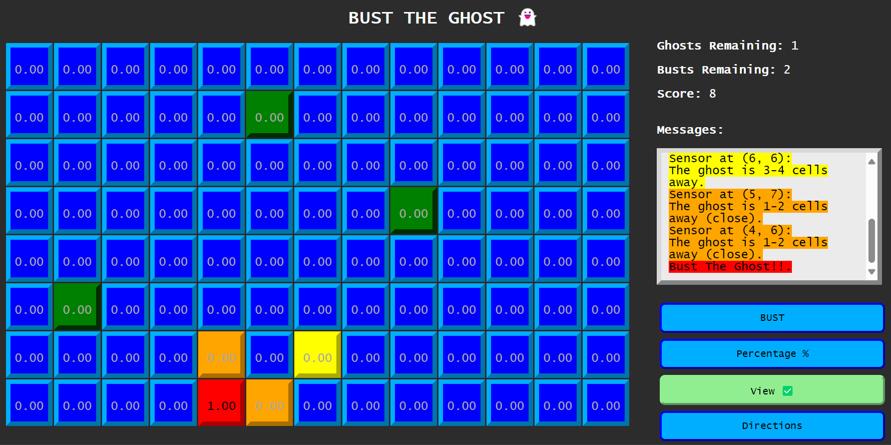
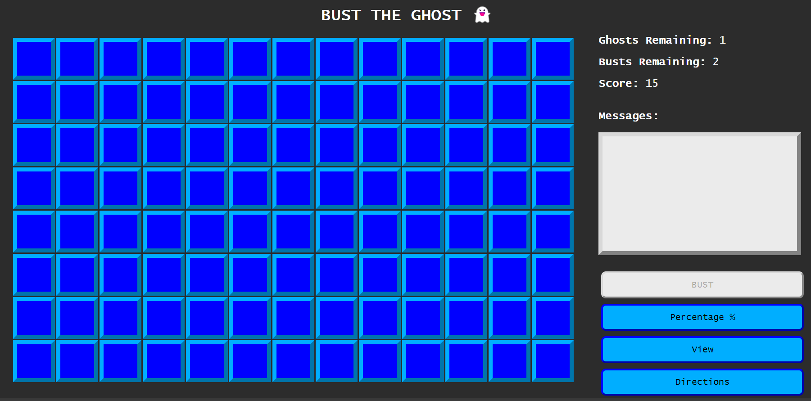
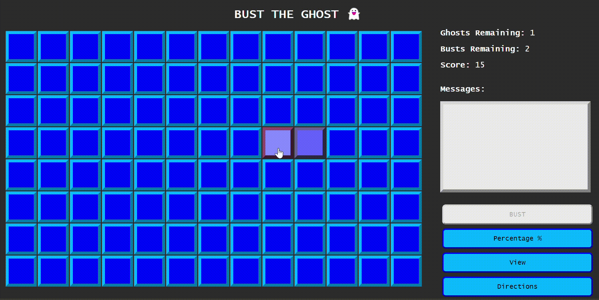
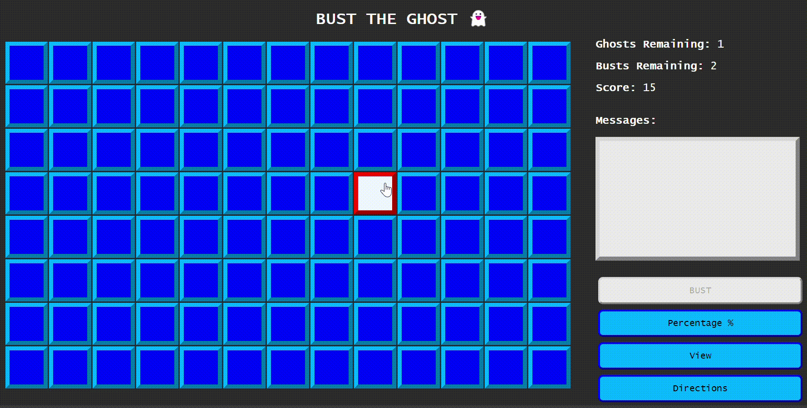

# Ghost Buster Game

*Game Preview*
<div align="center">
  <a href="https://github.com/yassineMtg/bust-the-ghost">
    
  </a>
</div>

> [!IMPORTANT]
> 
> [](https://bust-ghost.yassinemaatougui.tech/)
> 
> []()
> 
> [](https://github.com/yassineMtg/bust-the-ghost/tree/main/images)


###### Table of contents
<!--ts-->
   * [Game Structure](#game-structure)
     * [Task1: Basic Ghost Game](#task1-basic-ghost-game)
       * [1. Create a 8x13 Grid](#1-create-a-8x13-grid)
       * [2. Build Buttons](#2-build-buttons)
       * [3. Show Remaining Attempts and Score](#3-show-remaining-attempts-and-score)
       * [4. Place the Ghost](#4-place-the-ghost)
       * [5. Handle Cell Clicks](#5-handle-cell-clicks)
       * [6. Update Posterior Probabilities](#6-update-posterior-probabilities)
     * [Task2: Use a direction sensor with the distance sensor](#task2-use-a-direction-sensor-with-the-distance-sensor)
       * [a. Conditional Distributions](#a-conditional-distributions)
       * [b. Update Posterior Formula](#b-update-posterior-formula)
       * [c. Building Buttons](#c-building-buttons)
       * [d. GUI Updates](#d-gui-updates)
       * [e. Handling Data Storage](#e-handling-data-storage)
<!--te-->

## Game Structure

### Task1: Basic Ghost game

#### 1. Create a 8x13 Grid

*8x13 Grid UI*
<div align="center">
  <a href="https://github.com/yassineMtg/bust-the-ghost">
    
  </a>
</div>

```html
<div class="grid" id="gameGrid"></div>
```
```javascript
// Initialize the game
const gridWidth = 13;
const gridHeight = 8;
function initializeGame() {
    const grid = document.getElementById('gameGrid');
    document.getElementById('endGameScreen').style.display = 'none'; 
    grid.innerHTML = '';
    for (let y = 0; y < gridHeight; y++) {
        for (let x = 0; x < gridWidth; x++) {
            const cell = document.createElement('div');
            cell.className = 'cell';
            cell.dataset.x = x;
            cell.dataset.y = y;
            cell.onclick = () => selectCell(x, y);
            grid.appendChild(cell);
        }
    }
    placeGhost();
    updateDisplay();
} 
window.onload = initializeGame; // Initialize the game on load
function newGame(){ location.reload(); } //Handle new Game button
```

#### 2. Build Buttons
Build a button to Bust the ghost and another one called View.
* Bust the ghost button.
```html
<button class="button" id="bustButton" onclick="bust()" disabled>BUST</button>
```
```javascript
// Handle bust button
let bustedCells = [];
function bust() {
    if (!selectedCell) {
        document.getElementById('messages').innerHTML += "Please select a cell to bust !<br>";
        document.getElementById('messagesBox').scrollTop = messagesBox.scrollHeight;
        return;
    }
    const { x, y } = selectedCell;
    const alreadyBusted = bustedCells.some(cell => cell.x === x && cell.y === y); // Check if the cell has already been busted
    if (alreadyBusted) {
        document.getElementById('messages').innerHTML += "This cell has already been busted ! (Choose another cell)<br>";
        document.getElementById('messagesBox').scrollTop = messagesBox.scrollHeight;
        return;
    }
    // Add the selected cell to the bustedCells array
    bustedCells.push({ x, y });
    busts -= 1;  // Deduct a bust
    if (score > 0){
        if (selectedCell && ghostPosition.xg === selectedCell.x && ghostPosition.yg === selectedCell.y) {
            ghosts -= 1; // Reduce remaining score
            document.getElementById('messages').innerHTML += "You busted the ghost 👻 !<br>";
            document.getElementById('endGameScreen').style.display = 'flex'; 
            document.getElementById('endGameMessage').innerHTML = "You busted the ghost 👻 !";
            endgame = true; // End the game
            // Trigger confetti
            confetti({
                particleCount: 300,
                spread: 100,
                origin: { y: 0.6 },
                decay: 0.94,
                startVelocity: 30,
            });
        } else {
            score -= 1; // Deduct score for wrong guess
            document.getElementById('messages').innerHTML += `<span style="color: red">Wrong guess!</span><br>`;
            // Game over case (no more busts)
            if (busts <= 0 || score < 1) {
                document.getElementById('messages').innerHTML += "Game Over!<br>";
                document.getElementById('endGameScreen').style.display = 'flex'; 
                document.getElementById('endGameMessage').innerHTML = "Game Over!";
                endgame = true; // End the game
            }
        }
        if (endgame){
            document.getElementById('bustButton').disabled = true; // Disable buttons
            for (let y = 0; y < gridHeight; y++) // Show solution
                for (let x = 0; x < gridWidth; x++) sensorReading(x,y);
        }
        document.getElementById('messagesBox').scrollTop = messagesBox.scrollHeight;
        updateDisplay();
    }
    else if (score <= 0){
        score = 0;
        document.getElementById('messages').innerHTML += "Game Over!<br>";
        document.getElementById('endGameScreen').style.display = 'flex'; 
        document.getElementById('endGameMessage').innerHTML = "Game Over!";
        endgame = true; // End the game
        if (endgame){
            document.getElementById('bustButton').disabled = true; // Disable buttons
            for (let y = 0; y < gridHeight; y++) // Show solution
                for (let x = 0; x < gridWidth; x++) sensorReading(x,y);
        }
    }
}
```
* View is a toggle button. When ticked it should display the probability onto the squares, otherwise the probabilities should not show on the grid.
```html
<button class="button" id="viewButton" onclick="view()">View</button>
```
```javascript
// Handle view button
let isView = false; // hide/show the probabilities
function toggleView() {
    isView = !isView;
    const viewButton = document.getElementById('viewButton');
    viewButton.innerHTML = `View ${isView ? '✅' : ''}`;
    updateDisplay();
    isView ? viewButton.style.backgroundColor = "lightGreen" : viewButton.style.backgroundColor = "#00aeff";
    isView ? viewButton.style.borderColor = "lightGreen" : viewButton.style.borderColor = "blue";
    if (isView && isDirection) {
        document.getElementById('messages').innerHTML += "Direction and probability modes activated.<br>";
        document.getElementById('messagesBox').scrollTop = messagesBox.scrollHeight;
    }
    else if (isView) {
        document.getElementById('messages').innerHTML += "Probability mode activated.<br>";
        document.getElementById('messagesBox').scrollTop = messagesBox.scrollHeight;
    } 
    else if(!isView) {
        document.getElementById('messages').innerHTML += "Probability mode inactivated.<br>";
        document.getElementById('messagesBox').scrollTop = messagesBox.scrollHeight;
    }
}
```
#### 3. Show Remaining Attempts and Score
Show the remaining “bust” attempts & the remaining "score" and "ghosts" at any time.
```html
<div class="info">
    <p style="font-weight: bold;">Ghosts Remaining: <span style="font-weight: lighter;"  id="ghosts">1</span></p>
    <p style="font-weight: bold;">Busts Remaining: <span style="font-weight: lighter;" id="busts">2</span></p>
    <p style="font-weight: bold;">Score: <span style="font-weight: lighter;" id="score">50</span></p>
</div>
<div class="messages-div">
    <p style="font-weight: bold;">Messages:</p>
    <div id="messagesBox" style="color: black; background-color:#ebebeb; border: 6px outset #d8d8d8; margin-bottom: 20px; padding: 10px; height: 150px; overflow-y: auto;">
    <span style="font-weight: lighter;" id="messages"></span>
</div> 
</div>     
```
```javascript
// Update the display
let ghosts = 1;
let busts = 2;
let score = 15;
let endgame = false;
let hasClicked = false; //Displaying the exact probability number in the first state
function updateDisplay() {
    document.getElementById('ghosts').textContent = ghosts;
    document.getElementById('score').textContent = score;
    document.getElementById('busts').textContent = busts;
    const cells = document.querySelectorAll('.cell');
    cells.forEach(cell => {
        const x = parseInt(cell.dataset.x);
        const y = parseInt(cell.dataset.y);
        cell.textContent = '';
        cell.style.backgroundColor = '';
        cell.style.borderColor = '';
        cell.style.color = 'transparent';
        // Show colors (no mode selected)
        if (!isDirection) {
            let probability = colorsProbabilities[y][x];
            cell.style.backgroundColor = cellColors[y][x];
            cell.style.borderColor = cellColors[y][x];
        }
        // Show probability in View mode
        if (isView && !isDirection) {
            let probability = colorsProbabilities[y][x];
            if (isPercentageMode) {
                probability = probability.toFixed(2);
                probability = parseInt(probability *= 100);
            }
            cell.textContent = hasClicked ? (isPercentageMode ? probability + "%" : probability.toFixed(2)) : (isPercentageMode ? probability + "%" : probability.toFixed(4))
            cell.style.color = probability > 0 ? 'black' : 'darkGray';
            cell.style.backgroundColor = cellColors[y][x];
            cell.style.borderColor = cellColors[y][x];
        }
        // Show directions
        if (isDirection) {
            cell.style.backgroundColor = '';
            updateProbabilitiesWithDirection();
            let dirProb = directionalProbabilities[y][x];
            // Display uniform probabilities if no cell has been clicked
            if (!hasClicked) dirProb = 1 / (gridWidth * gridHeight); // Uniform value for the first state
            if (isPercentageMode) {
                dirProb = dirProb.toFixed(2);
                dirProb = parseInt(dirProb *= 100);
            }
            // Display directional probability or arrow
            const arrow = cellDirections[y][x];
            if (arrow) {
                cell.textContent = arrow;
                cell.style.color = 'black';
            } else {
                cell.textContent = hasClicked ? (isPercentageMode ? dirProb + "%" : dirProb.toFixed(2)) : (isPercentageMode ? dirProb + "%" : dirProb.toFixed(4));
                cell.style.color = dirProb > 0 ? 'black' : 'darkGray';
            }
            cell.style.backgroundColor = cellColors[y][x];
            cell.style.borderColor = cellColors[y][x];
        }
        // show probailities and direction
        if (isView && isDirection) {
            let dirProb = directionalProbabilities[y][x];
            let combinedProbability = 0;
            combinedProbability = colorsProbabilities[y][x] * dirProb;
            if (hasClicked) {
                // Combining color and direction probabilities
                // Normalizing combined probabilities across all cells
                const totalCombinedProbability = directionalProbabilities.flat().reduce((sum, dirProb, i) => {
                    const xIndex = i % gridWidth;
                    const yIndex = Math.floor(i / gridWidth);
                    return sum + colorsProbabilities[yIndex][xIndex] * dirProb;
                }, 0);
                if (totalCombinedProbability > 0) {
                    combinedProbability /= totalCombinedProbability; // Normalize              
                    if (isPercentageMode) {
                        combinedProbability = combinedProbability.toFixed(2);
                        combinedProbability = parseInt(combinedProbability *= 100);
                    }
                }
                const arrow = cellDirections[y][x]; // Display the result based on the direction arrow
                if (arrow) {
                    cell.textContent = arrow;
                    cell.style.color = 'black';
                } else {
                    cell.textContent = isPercentageMode ? combinedProbability + "%" : combinedProbability.toFixed(2);
                    cell.style.color = combinedProbability > 0 ? 'black' : 'darkGray';
                }
                cell.style.backgroundColor = cellColors[y][x];
                cell.style.borderColor = cellColors[y][x];
            } else {
                // Default probabilities before any clicks
                dirProb = 1 / (gridWidth * gridHeight);
                if (isPercentageMode) dirProb = parseInt(dirProb.toFixed(2) *= 100);
                cell.textContent = isPercentageMode ? dirProb + "%" : dirProb.toFixed(4);
                cell.style.color = "black";
            }
        }
    });
    if(score === 0){
        document.getElementById('messages').innerHTML += "Game Over!<br>";
        document.getElementById('messagesBox').scrollTop = messagesBox.scrollHeight;
    }
}
```
#### 4. Place the Ghost
Have the ghost be placed in one of the cells according to a prior distribution of Ghost over location P0 (Ghost). 
* Define a random variable `G`for ghost location with domain `[(1,1), (1,2), ....(7,13)]`
```javascript
let ghostPosition; // position of the ghost
const G = []; // Ghost location domain
for (let y = 0; y < gridHeight; y++) //initialize the domain with all cells positions
    for (let x = 0; x < gridWidth; x++) G.push({ x, y });
/* PlaceGhost() Place the ghost randomly and returns xg, yg (ghost position)*/
function placeGhost() {
    const random = Math.floor(Math.random() * G.length); //take a randome position from the domain G
    const xg = G[random].x;
    const yg = G[random].y;
    ghostPosition = { x: xg, y: yg };
    return ghostPosition = { xg, yg };
}
```
* Sample a uniform distribution for this.
* `ComputeInitialPriorProbabilities(locations)`
```javascript
// Compute InitialPrior Probabilities
let colorsProbabilities = Array(gridHeight).fill().map(() => Array(gridWidth).fill(1 / (gridWidth * gridHeight)));
```
#### 5. Handle Cell Clicks
When clicking a cell, the user/player does a sensor reading and gets a color.
  * Each click will make the player loose 1 point from an initial credit. 
  * When the credit runs out the player looses. 
  * The remaining credit should be updated and displayed after each click.
  * User can decide to "bust" a cell. 
  * If ghost is in the cell, the player wins otherwise he/she loses.
  * if the number of allowed busts (initialized to 2) runs out too.

*Remaining Bust Attempts*
<div align="center">
  <a href="https://github.com/yassineMtg/bust-the-ghost">
    
  </a>
</div>

*Remaining Score*
<div align="center">
  <a href="https://github.com/yassineMtg/bust-the-ghost">
    
  </a>
</div>

```javascript
// Handle cell selection
let selectedCell = null; // currently selected cell
function selectCell(x, y) {
    if (!endgame)
        if (score > 0){
            score -= 1; 
            selectedCell = { x, y };
            const cells = document.querySelectorAll('.cell');
            cells.forEach(c => c.classList.remove('selected')); // Remove previous selection
            const cell = document.querySelector(`.cell[data-x='${x}'][data-y='${y}']`);
            cell.classList.add('selected'); // Highlight the selected cell
            // Enable the Bust & Time button when a cell is selected
            document.getElementById('bustButton').disabled = false;
            sensorReading(x, y);
        } else {
            document.getElementById('messages').innerHTML += "Game Over!<br>";
            endgame = true;// End the game
            document.getElementById('endGameScreen').style.display = 'flex'; 
            document.getElementById('endGameMessage').innerHTML = "Game Over!";
            document.getElementById('bustButton').disabled = true; // Disable buttons
            for (let y = 0; y < gridHeight; y++) // Show solution
                for (let x = 0; x < gridWidth; x++) sensorReading(x,y);
        }
}
```
* Define variable `S` for sensor reading with domain `['red', 'orange', 'yellow', 'green']`
``` javascript
const S = ['red', 'orange', 'yellow', 'green']; // Sensor reading domain
```
* Define and use conditional probability distributions `P(Color/Distance from Ghost)` that reflects the sensor’s sensibility for each distance.

``` javascript
const P = {'red': 0.6500, 'orange': 0.20, 'yellow': 0.10, 'green': 0.050}; 
``` 

| Color | Distance | P(Ghost/Color) |
|-----|-----|-----|
| **Red** | 0 | 0.6500 | 
| **Orenge** | <= 2 | 0.20 |
| **Yellow** | >=3 <= 4 | 0.10 |
| **Green** | >= 5 | 0.050 |

| Selected Cell Color | P (Ghost/Selected Cell Color) for the other cells | Reasoning |
|---------------------|-------------------------------|-----------|
| **No Selected Cell** | 0.0096 | Uniform distribution across all cells if no specific cell is selected. |
| **Red** | 0.0 | If Red is selected, the ghost must be in the clicked cell. |
| **Orange** | 0.08 | If Orange is selected, nearby cells (1-2 away) are more likely. |
| **Yellow** | 0.04 | If Yellow is selected, cells 3-4 away are more probable. |
| **Green** | 0.02 | If Green is selected, cells far away are more probable. |

* `DistanceSense (xclk,yclk, dist, gx,gy)` returns a color based on the calculated distance from the ghost:
  * *On the ghost:* `red`
  * *1 or 2 cells away:* `orange`
  * *3 or 4 cells away:* `yellow`
  * *5+ cells away:* `green`

*Selected cell is green*
<div align="center">
  <a href="https://github.com/yassineMtg/bust-the-ghost">
    
  </a>
</div>

*Selected cell is yellow*
<div align="center">
  <a href="https://github.com/yassineMtg/bust-the-ghost">
    
  </a>
</div>

*Selected cell is orange*
<div align="center">
  <a href="https://github.com/yassineMtg/bust-the-ghost">
    
  </a>
</div>

*Selected cell is red*
<div align="center">
  <a href="https://github.com/yassineMtg/bust-the-ghost">
    
  </a>
</div>

``` javascript
// Separate conditional distribution tables for colors per distance
/* DistanceSense (xclk,yclk, dist, xg,yg) returns a color based on 
(i) the type of distance dist of the clicked position (xclk,yclk) from the ghost position (gs,yg) 
(ii) the conditional probability tables. 
For this you will have to sample the appropriate cond. distribution table to return the color.*/
function DistanceSense(xclk, yclk, dist, xg, yg) {
    dist = Math.abs(xclk - xg) + Math.abs(yclk - yg);
    if (dist === 0) return S[0];
    if (dist <= 2) return S[1];
    if (dist <= 4) return S[2];
    return S[3];
}

// Sensor reading: display color (and direction) based on distance
let selectedCells = [];
function sensorReading(x, y) {
    const color = DistanceSense(x, y, 0, ghostPosition.xg, ghostPosition.yg);
    cellColors[y][x] = color; // Store the color
    // Update colors probabilities
    UpdatePosteriorGhostLocationProbabilities(color, x, y); 

    // Display the color on the clicked cell
    const cell = document.querySelector(`.cell[data-x='${x}'][data-y='${y}']`);
    cell.style.backgroundColor = color;
    cell.style.borderColor = color;

    const direction = DirectionSense(x, y, ghostPosition.xg, ghostPosition.yg);
    cellDirections[y][x] = direction; // Save the clicked cell's direction and update probabilities
    // Update directional probabilities
    updateProbabilitiesWithDirection(x, y, direction);
    selectedCells.push({ x, y, color, direction });
    logMessages(x, y);
    if (!hasClicked) hasClicked = true;
    updateDisplay();
}

// show the messages on the message Box for the Distance sensor
function getDistanceMessage(color) {
    switch (color) {
        case 'red': return 'Bust The Ghost!!';
        case 'orange': return '1-2 cells away (close)';
        case 'yellow': return '3-4 cells away';
        case 'green': return 'far with more than 5 cells';
        default: return 'unknown';
    }
}
```

#### 6. Update Posterior Probabilities
Update Posterior Ghost Location Probabilities.
After each click number `t` in `{1, 2, 3 …}` at location Li the Posterior Probability of the Ghost locations $Pt(G = Li)$ should be updated using Bayesian inference as follows:
$Pt(G = Li) = P(S = Color at location Li | G = Li) * Pt-1(G = Lj)$
* With $P0(G = Lj)$ is a uniform distribution (Initial prior probability)
* And $P(S = Color at location Li | G = Li) = P(S = Color | distance = 0)$

You will need to normalize all the probabilities of the other locations, after each update of the posteriori probability of the clicked position `Li`.

*View Probability*
<div align="center">
  <a href="https://github.com/yassineMtg/bust-the-ghost">
    
  </a>
</div>

`UpdatePosteriorGhostLocationProbabilities(Color: c, xclk,yclk)`
```javascript
// Update probabilities using Bayesian inference
/* UpdatePosteriorGhostLocationProbabilities(Color: c, xclk, yclk)
updates the probabilities for each location based on the color c obtained/sensed at position xclk, yclk */
const clickedCells = []; // Cells clicked by the player
function UpdatePosteriorGhostLocationProbabilities(c, xclk, yclk) {
    let totalProbability = 0;
    clickedCells.push({ xclk, yclk }); // Add the clicked cell to the list of clicked cells
    if (c === 'red') { // If the ghost is in the selected cell
        for (let y = 0; y < gridHeight; y++) {
            for (let x = 0; x < gridWidth; x++) {
                colorsProbabilities[y][x] = (y === yclk && x === xclk) ? 1 : 0;
            }
        }
    } else {
        colorsProbabilities[yclk][xclk] = 0;  // Set the probability of the clicked cell to 0 if it’s not red
        for (let y = 0; y < gridHeight; y++) {
            for (let x = 0; x < gridWidth; x++) {
                const distance = Math.abs(x - xclk) + Math.abs(y - yclk);
                // Determine expected color based on distance from the clicked cell
                let expectedColor;
                if (distance === 0) expectedColor = 'red';
                else if (distance <= 2) expectedColor = 'orange';
                else if (distance <= 4) expectedColor = 'yellow';
                else expectedColor = 'green';
                // Apply the probability update rule based on the color match and set 0 for mismatches
                colorsProbabilities[y][x] *= (c === expectedColor) ? P[c] : 0;
                // Accumulate total probability for normalization
                totalProbability += colorsProbabilities[y][x];
            }
        }
        // Normalize the probabilities so that they sum to 1
        for (let y = 0; y < gridHeight; y++) {
            for (let x = 0; x < gridWidth; x++) {
                colorsProbabilities[y][x] /= totalProbability; // Normalize each probability
            }
        }
    }
}
```

### Task2: Use a direction sensor with the distance sensor
* The player/agent has now another independent sensor that gives directions of the Ghost. 
* This sensor can be used at any step in conjunction with the distance sensor at the same cell.

#### a. Conditional Distributions
Give the conditional distributions for the direction sensor.

*View Direction*
<div align="center">
  <a href="https://github.com/yassineMtg/bust-the-ghost">
    
  </a>
</div>

| Direction | Symbole | P |
|-----|-----|-----|
| **N** | ↑ | 0.125 | 
| **NE** | ↗ | 0.125 |
| **E** | → | 0.125 |
| **SE** | ↘ | 0.125 |
| **S** | ↓ | 0.125 | 
| **SW** | ↙ | 0.125 |
| **W** | ← | 0.125 |
| **NW** | ↖ | 0.125 |

* Combined Probability Table for Direction and Color Sensors:
    * This table presents the combined probabilities for the game's sensor system, which uses both direction and color sensors. 
    * The joint probabilities are calculated by multiplying the probability of a given direction by the probability of a given color (based on distance from the ghost).

| **Direction** | **Symbol** | **Color**  | **Distance** | **Joint Probability P(Direction, Color)** |
|---------------|------------|------------|--------------|-------------------------------------------|
| N             | ↑          | Red        | 0            | 0.125 × 0.6500 = 0.08125               |
| N             | ↑          | Orange     | ≤ 2          | 0.125 × 0.20 = 0.025                   |
| N             | ↑          | Yellow     | 3 ≤ d ≤ 4    | 0.125 × 0.10 = 0.0125                  |
| N             | ↑          | Green      | ≥ 5          | 0.125 × 0.050 = 0.00625                |
| NE            | ↗          | Red        | 0            | 0.125 × 0.6500 = 0.08125               |
| NE            | ↗          | Orange     | ≤ 2          | 0.125 × 0.20 = 0.025                   |
| NE            | ↗          | Yellow     | 3 ≤ d ≤ 4    | 0.125 × 0.10 = 0.0125                  |
| NE            | ↗          | Green      | ≥ 5          | 0.125 × 0.050 = 0.00625                |
| E             | →          | Red        | 0            | 0.125 × 0.6500 = 0.08125               |
| E             | →          | Orange     | ≤ 2          | 0.125 × 0.20 = 0.025                   |
| E             | →          | Yellow     | 3 ≤ d ≤ 4    | 0.125 × 0.10 = 0.0125                  |
| E             | →          | Green      | ≥ 5          | 0.125 × 0.050 = 0.00625                |
| SE            | ↘          | Red        | 0            | 0.125 × 0.6500 = 0.08125               |
| SE            | ↘          | Orange     | ≤ 2          | 0.125 × 0.20 = 0.025                   |
| SE            | ↘          | Yellow     | 3 ≤ d ≤ 4    | 0.125 × 0.10 = 0.0125                  |
| SE            | ↘          | Green      | ≥ 5          | 0.125 × 0.050 = 0.00625                |
| S             | ↓          | Red        | 0            | 0.125 × 0.6500 = 0.08125               |
| S             | ↓          | Orange     | ≤ 2          | 0.125 × 0.20 = 0.025                   |
| S             | ↓          | Yellow     | 3 ≤ d ≤ 4    | 0.125 × 0.10 = 0.0125                  |
| S             | ↓          | Green      | ≥ 5          | 0.125 × 0.050 = 0.00625                |
| SW            | ↙          | Red        | 0            | 0.125 × 0.6500 = 0.08125               |
| SW            | ↙          | Orange     | ≤ 2          | 0.125 × 0.20 = 0.025                   |
| SW            | ↙          | Yellow     | 3 ≤ d ≤ 4    | 0.125 × 0.10 = 0.0125                  |
| SW            | ↙          | Green      | ≥ 5          | 0.125 × 0.050 = 0.00625                |
| W             | ←          | Red        | 0            | 0.125 × 0.6500 = 0.08125               |
| W             | ←          | Orange     | ≤ 2          | 0.125 × 0.20 = 0.025                   |
| W             | ←          | Yellow     | 3 ≤ d ≤ 4    | 0.125 × 0.10 = 0.0125                  |
| W             | ←          | Green      | ≥ 5          | 0.125 × 0.050 = 0.00625                |
| NW            | ↖          | Red        | 0            | 0.125 × 0.6500 = 0.08125               |
| NW            | ↖          | Orange     | ≤ 2          | 0.125 × 0.20 = 0.025                   |
| NW            | ↖          | Yellow     | 3 ≤ d ≤ 4    | 0.125 × 0.10 = 0.0125                  |
| NW            | ↖          | Green      | ≥ 5          | 0.125 × 0.050 = 0.00625                |

> [!NOTE]
>**Direction Probabilities**: Each of the 8 directions (N, NE, E, SE, S, SW, W, NW) has an equal probability of 0.125.
>- **Color Probabilities**: The probabilities for each color are based on the distance from the ghost:
>  - **Red**: Probability 0.6500 when directly on the ghost.
>  - **Orange**: Probability 0.20 when within 2 cells of the ghost.
>  - **Yellow**: Probability 0.10 when 3-4 cells away.
>  - **Green**: Probability 0.050 when 5 or more cells away.
>- **Joint Probability Calculation**: The joint probability \( P(\text{Direction}, \text{Color}) \) is the product of the individual probabilities, assuming the two events are independent.

``` javascript
let directionalProbabilities = Array(gridHeight).fill().map(() => Array(gridWidth).fill(1 / (gridWidth * gridHeight)));
// Directions Domain
const D = { N: "↑", NE: "↗", E: "→", SE: "↘", S: "↓", SW: "↙", W: "←", NW: "↖" };
// Conditional probability distributions P( Direction | Direction of the Ghost )
const PD = { N: 0.125, NE: 0.125, E: 0.125, SE: 0.125, S: 0.125, SW: 0.125, W: 0.125, NW: 0.125 };
// Store direction for each cell
const cellDirections = Array(gridHeight).fill().map(() => Array(gridWidth).fill('')); 

function DirectionSense(xclk, yclk, gx, gy) {
    const dx = gx - xclk;
    const dy = gy - yclk;
    if (dx === 0 && dy < 0) return D.N;
    if (dx > 0 && dy < 0) return D.NE;
    if (dx > 0 && dy === 0) return D.E;
    if (dx > 0 && dy > 0) return D.SE;
    if (dx === 0 && dy > 0) return D.S;
    if (dx < 0 && dy > 0) return D.SW;
    if (dx < 0 && dy === 0) return D.W;
    if (dx < 0 && dy < 0) return D.NW;
    return '👻'; // Default fallback if the ghost is directly on the clicked cell
}
```

#### b. Update Posterior Formula
Rewrite the formula for updating the posterior probabilities.
The update can happen given evidence from either or both sensors at the same time.
``` javascript
// Update directional probabilities 
function updateProbabilitiesWithDirection() {
    // Reset the directional probabilities
    directionalProbabilities = Array(gridHeight).fill().map(() => Array(gridWidth).fill(0));
    let intersectedCells = []; // To store the intersected cells
    let totalProbability = 0;
    // For each selected cell and direction, get its target cells
    selectedCells.forEach(({ x, y, direction }, index) => {
        const cellsInDirection = getCellsInDirectionExtended({ x, y }, direction);
        // First selected cell - initialize intersectedCells
        if (index === 0) intersectedCells = cellsInDirection; 
        // Calculate intersection with previously tracked cells
        else intersectedCells = intersectedCells.filter(cell =>
                cellsInDirection.some(target => target.x === cell.x && target.y === cell.y)
            );
    });
    // Distribute probabilities among intersected cells
    if (intersectedCells.length > 0) {
        const probShare = 1 / intersectedCells.length;
        intersectedCells.forEach(({ x, y }) => {
            directionalProbabilities[y][x] += probShare;
        });
    }
    // Normalize probabilities across the intersected cells
    totalProbability = directionalProbabilities.flat().reduce((sum, prob) => sum + prob, 0);
    if (totalProbability > 0) {
        for (let y = 0; y < gridHeight; y++) {
            for (let x = 0; x < gridWidth; x++) {
                directionalProbabilities[y][x] /= totalProbability;
            }
        }
    }
}
```


### c. Building Buttons

#### Build percentage & direction buttons:

##### 1- Percentage button

``` html
 <button class="button" id="percentageToggle" onclick="togglePercentage()">Percentage %</button>
```

``` javascript

// Handle Percentage button
let isPercentageMode = false;
function togglePercentage() {
    isPercentageMode = !isPercentageMode;
    const percentageButton = document.getElementById('percentageToggle');
    percentageButton.innerHTML = isPercentageMode ? "Fractional" : "Percentage %";
    percentageButton.style.backgroundColor = isPercentageMode ? "orange" : "#00aeff";
    percentageButton.style.borderColor = isPercentageMode ? "orange" : "blue";
    updateDisplay(); // Refresh the display
    if (isPercentageMode) {
        document.getElementById('messages').innerHTML += "Percentage probabilities.<br>";
        document.getElementById('messagesBox').scrollTop = messagesBox.scrollHeight;
    } else{
        document.getElementById('messages').innerHTML += "Fractional probabilities.<br>";
        document.getElementById('messagesBox').scrollTop = messagesBox.scrollHeight;
    }
}
```
##### 2- direction button
``` html
<button class="button" id="directionButton" onclick="toggleDirection()">Directions</button>
```
``` javascript
// Handle direction button
function toggleDirection() {
    isDirection = !isDirection;
    const directionButton = document.getElementById('directionButton');
    directionButton.innerHTML = `Directions ${isDirection ? '✅' : ''}`;
    updateProbabilitiesWithDirection();
    updateDisplay();
    isDirection ? directionButton.style.backgroundColor = "lightGreen" : directionButton.style.backgroundColor = "#00aeff";
    isDirection ? directionButton.style.borderColor = "lightGreen" : directionButton.style.borderColor = "blue";
    if (isView && isDirection) {
        document.getElementById('messages').innerHTML += "Color and direction modes activated.<br>";
        document.getElementById('messagesBox').scrollTop = messagesBox.scrollHeight;
    } else if (isDirection) {
        document.getElementById('messages').innerHTML += "Direction mode activated.<br>";
        document.getElementById('messagesBox').scrollTop = messagesBox.scrollHeight;
    } else if(!isDirection) {
        document.getElementById('messages').innerHTML += "Direction mode inactivated.<br>";
        document.getElementById('messagesBox').scrollTop = messagesBox.scrollHeight;
    }
}
```
## Handling already busted cells

### Updating GUI when using two sensors (Direction & Color)

#### 1- Display messages on the message box (two sencors activated)
```javascript
// display messages on the message box
function logMessages(x, y) {
    const messages = document.getElementById('messages');
    const selectedDirection = cellDirections[y][x];
    const selectedColor = cellColors[y][x];
    // Combine View and Direction modes
    if (isView && isDirection && (selectedDirection && selectedColor))
        switch (selectedDirection) {
            case D.NE: messages.innerHTML += `<span style="background-color: ${selectedColor.toLowerCase()}">The ghost is in the NorthEast, and is ${getDistanceMessage(selectedColor)}</span><br>`;
                break;
            case D.NW: messages.innerHTML += `<span style="background-color: ${selectedColor.toLowerCase()}">The ghost is in the NorthWest, and is ${getDistanceMessage(selectedColor)}</span><br>`;
                break;
            case D.SE: messages.innerHTML += `<span style="background-color: ${selectedColor.toLowerCase()}">The ghost is in the SouthEast, and is ${getDistanceMessage(selectedColor)}</span><br>`;
                break;
            case D.SW: messages.innerHTML += `<span style="background-color: ${selectedColor.toLowerCase()}">The ghost is in the SouthWest, and is ${getDistanceMessage(selectedColor)}</span><br>`;
                break;
            case D.N: messages.innerHTML += `<span style="background-color: ${selectedColor.toLowerCase()}">The ghost is directly North, and is ${getDistanceMessage(selectedColor)}</span><br>`;
                break;
            case D.S: messages.innerHTML += `<span style="background-color: ${selectedColor.toLowerCase()}">The ghost is directly South, and is ${getDistanceMessage(selectedColor)}</span><br>`;
                break;
            case D.E: messages.innerHTML += `<span style="background-color: ${selectedColor.toLowerCase()}">The ghost is directly East, and is ${getDistanceMessage(selectedColor)}</span><br>`;
                break;
            case D.W: messages.innerHTML += `<span style="background-color: ${selectedColor.toLowerCase()}">The ghost is directly West, and is ${getDistanceMessage(selectedColor)}</span><br>`;
                break;
            default: messages.innerHTML += `<span style="background-color: ${selectedColor.toLowerCase()}">Bust The Ghost!</span><br>`;
        }
    
    document.getElementById('messagesBox').scrollTop = messagesBox.scrollHeight; // scroll down the box
}
```
### Updating display

#### 1- Show directions
  
```javascript
// Show directions
        if (isDirection) {
            cell.style.backgroundColor = '';
            updateProbabilitiesWithDirection();
            let dirProb = directionalProbabilities[y][x];
            // Display uniform probabilities if no cell has been clicked
            if (!hasClicked) dirProb = 1 / (gridWidth * gridHeight); // Uniform value for the first state
            if (isPercentageMode) {
                dirProb = dirProb.toFixed(2);
                dirProb = parseInt(dirProb *= 100);
            }
            // Display directional probability or arrow
            const arrow = cellDirections[y][x];
            if (arrow) {
                cell.textContent = arrow;
                cell.style.color = 'black';
                cell.style.backgroundColor = 'white';
                if(arrow === '👻')
                    cell.style.backgroundColor = "black";
            } else {
                cell.textContent = hasClicked ? (isPercentageMode ? dirProb + "%" : dirProb.toFixed(2)) : (isPercentageMode ? dirProb + "%" : dirProb.toFixed(4));
                cell.style.color = dirProb > 0 ? 'black' : 'darkGray';
            }
        }
```
#### 2- Show probabilities & directions

```javascript
 
        // show probailities and direction
        if (isView && isDirection) {
            let dirProb = directionalProbabilities[y][x];
            let combinedProbability = 0;
            combinedProbability = colorsProbabilities[y][x] * dirProb;
            if (hasClicked) {
                // Combining color and direction probabilities
                // Normalizing combined probabilities across all cells
                const totalCombinedProbability = directionalProbabilities.flat().reduce((sum, dirProb, i) => {
                    const xIndex = i % gridWidth;
                    const yIndex = Math.floor(i / gridWidth);
                    return sum + colorsProbabilities[yIndex][xIndex] * dirProb;
                }, 0);
                if (totalCombinedProbability > 0) {
                    combinedProbability /= totalCombinedProbability; // Normalize              
                    if (isPercentageMode) {
                        combinedProbability = combinedProbability.toFixed(2);
                        combinedProbability = parseInt(combinedProbability *= 100);
                    }
                }
                const arrow = cellDirections[y][x]; // Display the result based on the direction arrow
                if (arrow) {
                    cell.textContent = arrow;
                    cell.style.color = 'black';
                } else {
                    cell.textContent = isPercentageMode ? combinedProbability + "%" : combinedProbability.toFixed(2);
                    cell.style.color = combinedProbability > 0 ? 'black' : 'darkGray';
                }
                cell.style.backgroundColor = cellColors[y][x];
                cell.style.borderColor = cellColors[y][x];
            } else {
                // Default probabilities before any clicks
                dirProb = 1 / (gridWidth * gridHeight);
                if (isPercentageMode) {
                        dirProb = dirProb.toFixed(2);
                        dirProb = parseInt(dirProb *= 100);
                }
                cell.textContent = isPercentageMode ? dirProb + "%" : dirProb.toFixed(4);
                cell.style.color = "black";
            }
        }
    });
    if(score === 0){
        document.getElementById('messages').innerHTML += "Game Over!<br>";
        document.getElementById('messagesBox').scrollTop = messagesBox.scrollHeight;
    }
```
### d. GUI Updates
#### Update your GUI for use of the two sensors. 
#### Implement changes a and b in your code and demonstrate proper working.

*View Probability & Direction*
<div align="center">
  <a href="https://github.com/yassineMtg/bust-the-ghost">
    
  </a>
</div>

``` javascript
let isDirection = false; // Direction button
function getCellsInDirectionExtended(startCell, direction) {
    const { x, y } = startCell;
    const cells = [];
    switch (direction) {
        case D.N: // North
            for (let i = y - 1; i >= 0; i--) cells.push({ x, y: i });
            break;
        case D.S: // South
            for (let i = y + 1; i < gridHeight; i++) cells.push({ x, y: i });
            break;
        case D.E: // East
            for (let i = x + 1; i < gridWidth; i++) cells.push({ x: i, y });
            break;
        case D.W: // West
            for (let i = x - 1; i >= 0; i--) cells.push({ x: i, y });
            break;
        case D.NE: // North-East
            for (let i = 1; x + i < gridWidth; i++) 
                for (let j = 1; y - j >= 0; j++) cells.push({ x: x + i, y: y - j });
            break;
        case D.SE: // South-East
            for (let i = 1; x + i < gridWidth; i++) 
                for (let j = 1; y + j < gridHeight; j++) cells.push({ x: x + i, y: y + j });
            break;
        case D.SW: // South-West
            for (let i = 1; x - i >= 0; i++) 
                for (let j = 1; y + j < gridHeight; j++) cells.push({ x: x - i, y: y + j });
            break;
        case D.NW: // North-West
            for (let i = 1; x - i >= 0; i++) 
                for (let j = 1; y - j >= 0; j++) cells.push({ x: x - i, y: y - j });
            break;
        default:
            return [];
    }
    return cells;
}

// display messages on the message box
function logMessages(x, y) {
    const messages = document.getElementById('messages');
    const selectedDirection = cellDirections[y][x];
    const selectedColor = cellColors[y][x];
    // Combine View and Direction modes
    if (isView && isDirection && (selectedDirection && selectedColor))
        switch (selectedDirection) {
            case D.NE: messages.innerHTML += `<span style="background-color: ${selectedColor.toLowerCase()}">The ghost is in the NorthEast, and is ${getDistanceMessage(selectedColor)}</span><br>`;
                break;
            case D.NW: messages.innerHTML += `<span style="background-color: ${selectedColor.toLowerCase()}">The ghost is in the NorthWest, and is ${getDistanceMessage(selectedColor)}</span><br>`;
                break;
            case D.SE: messages.innerHTML += `<span style="background-color: ${selectedColor.toLowerCase()}">The ghost is in the SouthEast, and is ${getDistanceMessage(selectedColor)}</span><br>`;
                break;
            case D.SW: messages.innerHTML += `<span style="background-color: ${selectedColor.toLowerCase()}">The ghost is in the SouthWest, and is ${getDistanceMessage(selectedColor)}</span><br>`;
                break;
            case D.N: messages.innerHTML += `<span style="background-color: ${selectedColor.toLowerCase()}">The ghost is directly North, and is ${getDistanceMessage(selectedColor)}</span><br>`;
                break;
            case D.S: messages.innerHTML += `<span style="background-color: ${selectedColor.toLowerCase()}">The ghost is directly South, and is ${getDistanceMessage(selectedColor)}</span><br>`;
                break;
            case D.E: messages.innerHTML += `<span style="background-color: ${selectedColor.toLowerCase()}">The ghost is directly East, and is ${getDistanceMessage(selectedColor)}</span><br>`;
                break;
            case D.W: messages.innerHTML += `<span style="background-color: ${selectedColor.toLowerCase()}">The ghost is directly West, and is ${getDistanceMessage(selectedColor)}</span><br>`;
                break;
            default: messages.innerHTML += `<span style="background-color: ${selectedColor.toLowerCase()}">Bust The Ghost!</span><br>`;
        }
    // Direction mode
    else if (isDirection && selectedDirection)
        switch (selectedDirection) {
            case D.NE: messages.innerHTML += `<span>The ghost is in the NorthEast.</span><br>`;
                break;
            case D.NW: messages.innerHTML += `<span>The ghost is in the NorthWest.</span><br>`;
                break;
            case D.SE: messages.innerHTML += `<span>The ghost is in the SouthEast.</span><br>`;
                break;
            case D.SW: messages.innerHTML += `<span>The ghost is in the SouthWest.</span><br>`;
                break;
            case D.N: messages.innerHTML += `<span>The ghost is directly North.</span><br>`;
                break;
            case D.S: messages.innerHTML += `<span>The ghost is directly South.</span><br>`;
                break;
            case D.E: messages.innerHTML += `<span>The ghost is directly East.</span><br>`;
                break;
            case D.W: messages.innerHTML += `<span>The ghost is directly West.</span><br>`;
                break;
            default: messages.innerHTML += `<span>Bust The Ghost!</span><br>`;
        }
    // View mode
    else {
        if (selectedColor !== "red")  messages.innerHTML += `<span style="background-color: ${selectedColor.toLowerCase()}"> Sensor at (${x}, ${y}): <br> The ghost is ${getDistanceMessage(selectedColor)}.</span><br>`;
        else messages.innerHTML += `<span style="background-color: ${selectedColor.toLowerCase()}">${getDistanceMessage(selectedColor)}.</span><br>`;
    }
    document.getElementById('messagesBox').scrollTop = messagesBox.scrollHeight; // scroll down the box
}

// Handle direction button
function toggleDirection() {
    isDirection = !isDirection;
    const directionButton = document.getElementById('directionButton');
    directionButton.innerHTML = `Directions ${isDirection ? '✅' : ''}`;
    updateProbabilitiesWithDirection();
    updateDisplay();
    isDirection ? directionButton.style.backgroundColor = "lightGreen" : directionButton.style.backgroundColor = "#00aeff";
    isDirection ? directionButton.style.borderColor = "lightGreen" : directionButton.style.borderColor = "blue";
    if (isView && isDirection) {
        document.getElementById('messages').innerHTML += "Color and direction modes activated.<br>";
        document.getElementById('messagesBox').scrollTop = messagesBox.scrollHeight;
    } else if (isDirection) {
        document.getElementById('messages').innerHTML += "Direction mode activated.<br>";
        document.getElementById('messagesBox').scrollTop = messagesBox.scrollHeight;
    } else if(!isDirection) {
        document.getElementById('messages').innerHTML += "Direction mode inactivated.<br>";
        document.getElementById('messagesBox').scrollTop = messagesBox.scrollHeight;
    }
}
```
### e. Handling Data Storage

#### 1- Creating an array to store the clicked cells

```javascript
let isDirection = false; // Direction button
function getCellsInDirectionExtended(startCell, direction) {
    const { x, y } = startCell;
    const cells = [];
    switch (direction) {
        case D.N: // North
            for (let i = y - 1; i >= 0; i--) cells.push({ x, y: i });
            break;
        case D.S: // South
            for (let i = y + 1; i < gridHeight; i++) cells.push({ x, y: i });
            break;
        case D.E: // East
            for (let i = x + 1; i < gridWidth; i++) cells.push({ x: i, y });
            break;
        case D.W: // West
            for (let i = x - 1; i >= 0; i--) cells.push({ x: i, y });
            break;
        case D.NE: // North-East
            for (let i = 1; x + i < gridWidth; i++) 
                for (let j = 1; y - j >= 0; j++) cells.push({ x: x + i, y: y - j });
            break;
        case D.SE: // South-East
            for (let i = 1; x + i < gridWidth; i++) 
                for (let j = 1; y + j < gridHeight; j++) cells.push({ x: x + i, y: y + j });
            break;
        case D.SW: // South-West
            for (let i = 1; x - i >= 0; i++) 
                for (let j = 1; y + j < gridHeight; j++) cells.push({ x: x - i, y: y + j });
            break;
        case D.NW: // North-West
            for (let i = 1; x - i >= 0; i++) 
                for (let j = 1; y - j >= 0; j++) cells.push({ x: x - i, y: y - j });
            break;
        default:
            return [];
    }
    return cells;
}
```
#### 2- Keeping track of busted cells

```javascript
// Handle bust button
let bustedCells = [];
function bust() {
    if (!selectedCell) {
        document.getElementById('messages').innerHTML += "Please select a cell to bust !<br>";
        document.getElementById('messagesBox').scrollTop = messagesBox.scrollHeight;
        return;
    }
    const { x, y } = selectedCell;
    const alreadyBusted = bustedCells.some(cell => cell.x === x && cell.y === y); // Check if the cell has already been busted
    if (alreadyBusted) {
        document.getElementById('messages').innerHTML += "This cell has already been busted ! (Choose another cell)<br>";
        document.getElementById('messagesBox').scrollTop = messagesBox.scrollHeight;
        return;
    }
    // Add the selected cell to the bustedCells array
    bustedCells.push({ x, y });
```
